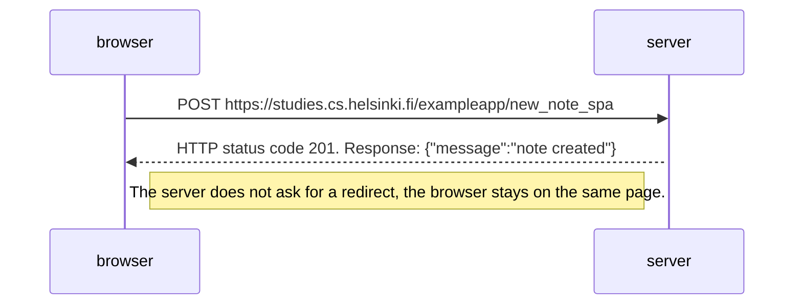

```mermaid
sequenceDiagram
    participant browser
    participant server

    browser->>server: POST https://studies.cs.helsinki.fi/exampleapp/new_note_spa
    activate server
    server-->>browser: HTTP status code 201. Response: {"message":"note created"}
    Note left of server: The server does not ask for a redirect, the browser stays on the same page.
```